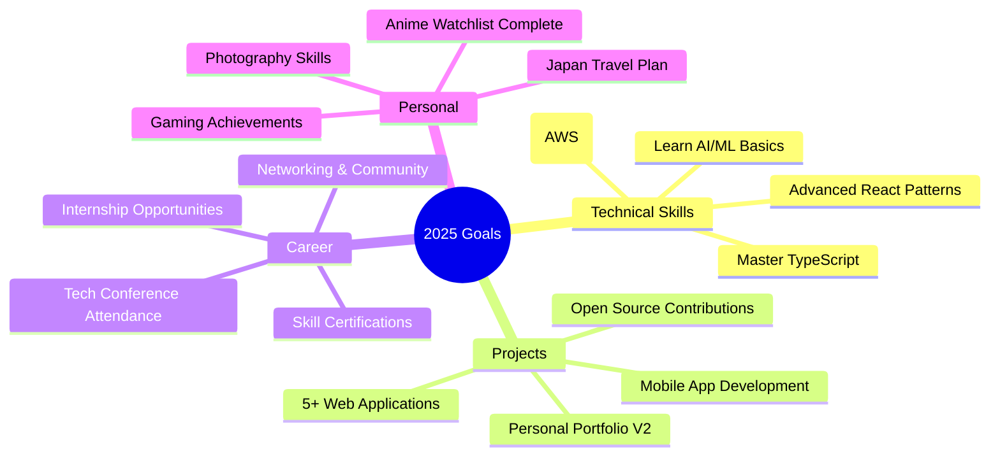

# 👋 Hi, I'm Joynal Bokhsho

<div align="center">
  
</div>

<div align="center">
  
</div>

---

## 🎓 About Me

<div align="center">
  
</div>


### 🚀 What I'm Up To:
- 📚 **Studying** Real Estate at Daffodil International University
- 💻 **Building** innovative full-stack web applications
- 🌱 **Contributing** to open source projects
- 🎮 **Gaming** in my free time (Valorant, Minecraft, CS2)
- 📖 **Learning** new technologies every day
- ✨ **Creating** digital solutions that matter

### 🎯 Current Focus:
```typescript
const currentGoals = {
  education: "Real Estate @ DIU",
  development: ["React", "Next.js", "TypeScript", "Node.js"],
  projects: "Building awesome web apps",
  contribution: "Open source community",
  gaming: "Climbing Valorant ranks 🎯",
  growth: "Never stop learning! 🚀"
};
```

---

## 🛠️ Tech Arsenal

<div align="center">
  
</div>

### **🎨 Frontend Magic**
<div align="center">
  


</div>

### **⚡ Backend Power**
<div align="center">
  


</div>

### **🔧 Tools & Environment**
<div align="center">
  


</div>

---

## 🚀 Featured Projects

<div align="center">
  
</div>

### 🎓 [DIU Result Lookup](https://github.com/joynalbokhsho/diu-result-lookup-react)
```yaml
Description: A React-based web application for DIU students
Tech Stack: React, JavaScript, CSS3
Features: 
  - Easy result lookup
  - Student-friendly interface
  - Responsive design
Status: ✅ Complete
```

<div align="center">
  
[](https://github.com/joynalbokhsho/diu-result-lookup-react)
[](https://github.com/joynalbokhsho/diu-result-lookup-react)

</div>

---

## 📊 GitHub Analytics

<div align="center">
  
</div>

<div align="center">
  
  
</div>

<div align="center">
  
</div>

### 📈 Contribution Graph
<div align="center">
  
</div>

---

## 🏆 Achievements & Trophies

<div align="center">
  
</div>

<div align="center">
  
</div>

### 📊 Profile Statistics
<div align="center">
  


</div>

---

## 🎮 Interests & Passions

<div align="center">
  
</div>

<table align="center">
<tr>
<td align="center" width="50%">

### 🎮 Gaming
```yaml
Current Games:
  - Valorant: "Grinding ranked matches 🎯"
  - Minecraft: "Building epic structures 🏗️"
  - CS2: "Tactical gameplay enthusiast 💥"
  
Gaming Style: "Competitive & Creative"
Favorite Genre: "FPS & Sandbox"
```

</td>
<td align="center" width="50%">

### 📺 Anime & Manga
```yaml
Status: "Certified Otaku 🍜"
Watching: "Seasonal anime"
Reading: "Multiple manga series"
Favorites: 
  - "Demon Slayer" 
  - "One Piece"
```

</td>
</tr>
<tr>
<td align="center" width="50%">

### 💻 Coding
```yaml
Passion: "Building digital solutions"
Focus: "Full-stack development"
Style: "Clean & efficient code"
Learning: "Always exploring new tech"
```

</td>
<td align="center" width="50%">

### 🌱 Other Interests
```yaml
Reading: "Novels & tech articles 📚"
Travel: "Exploring new places ✈️"
Music: "Anime OSTs while coding 🎵"
Photography: "Capturing moments 📸"
```

</td>
</tr>
</table>

---

## 🎯 2025 Roadmap

<div align="center">
  
</div>



### ✅ Progress Tracking

- [x] **Setup Development Environment** - Complete setup with latest tools
- [x] **Learn React Fundamentals** - Solid foundation established
- [ ] **Master TypeScript** - 60% Complete
- [ ] **Build 5+ Projects** - 1/5 Complete
- [ ] **Open Source Contributions** - Starting soon
- [ ] **Learn Cloud Platforms** - Research phase
- [ ] **Mobile Development** - Planning phase

---

## 🛠️ Skills Progress

<div align="center">
  
</div>

```yaml
Programming Languages:
  JavaScript: ████████░░ 80%
  TypeScript: ██████░░░░ 60%
  PHP: ███████░░░ 70%
  HTML/CSS: █████████░ 90%

Frameworks & Libraries:
  React: ████████░░ 80%
  Next.js: ██████░░░░ 60%
  Node.js: ███████░░░ 70%
  Express: ███████░░░ 70%

Tools & Technologies:
  Git/GitHub: █████████░ 90%
  VS Code: █████████░ 90%
  Database: ██████░░░░ 60%
  Design: █████░░░░░ 50%
```

---

## 🌟 Daily Quote

<div align="center">
  
</div>

---

## 📫 Let's Connect!

<div align="center">
  
</div>

<div align="center">
  
[](mailto:shaownsilva@gmail.com)
[](https://www.linkedin.com/in/joynalbokhsho/)
[](https://joynalbokhsho.me)
[](https://github.com/joynalbokhsho)

[](https://facebook.com/joynal.official)
[](https://instagram.com/jo_jo.503)
[](https://x.com/joynalbokhsho)
[](https://discord.com/users/466182014614372362)

</div>

### 💬 Quick Contact
```yaml
📧 Email: shaownsilva@gmail.com
💼 LinkedIn: linkedin.com/in/joynalbokhsho
🌐 Portfolio: joynalbokhsho.me
📱 Social: @joynalbokhsho

Response Time: Usually within 24 hours
Best Time to Reach: 9 PM - 12 AM (GMT+6)
Languages: Bengali (Native), English (Fluent)
```

---

## 🎨 Fun Developer Facts

<div align="center">
  
</div>

<table align="center">
<tr>
<td align="center" width="33%">

### 🌙 Night Owl
```
Coding Hours:
┌─────────────────────┐
│ 🌅 06:00 - ██░░░░░░│
│ 🌞 12:00 - ████░░░░│
│ 🌆 18:00 - ██████░░│
│ 🌙 00:00 - ████████│
└─────────────────────┘
Peak: After Midnight
```

</td>
<td align="center" width="33%">

### 🎵 Coding Soundtrack
```
Current Playlist:
♪ Anime OSTs (40%)
♪ Gaming Music (30%)
♪ Lo-fi Hip Hop (20%)
♪ Synthwave (10%)

Favorite: Attack on Titan OST
Effect: +50% Productivity
```

</td>
<td align="center" width="33%">

### ☕ Fuel Source
```
Daily Consumption:
┌─────────────────┐
│ ☕ Coffee: ████ │
│ 🍵 Tea: ██░░░░ │
│ 🥤 Energy: ░░░░│
│ 💧 Water: ██████│
└─────────────────┘
```

</td>
</tr>
</table>

### 🎮 Gaming Stats
```
🎯 Valorant Rank: Gold II (Climbing!)
⛏️ Minecraft Builds: 50+ Structures
💥 CS2 Matches: 200+ Hours
🏆 Gaming Achievements: Countless
```

### 📺 Anime Progress
```
📊 Completed Series: 100+ | 5,525+ Episodes Watched
📚 Manga Chapters Read: 1,628+
⭐ Favorite Genre: Shonen, Isekai
🍜 Otaku Level: Maximum
```

---

<div align="center">
  
</div>

<div align="center">
  
</div>

---

<div align="center">
  <sub>💖 Made with love, lots of coffee, and a dash of anime magic ✨</sub><br>
  <sub>Last updated: July 2025</sub>
</div>
