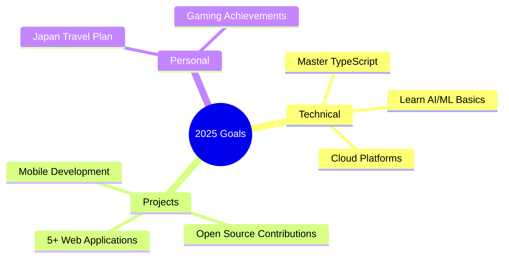

# 👋 Hi, I'm Joynal Bokhsho

  

  

---

## 🎓 About Me

**Real Estate Student at DIU** | **Full Stack Developer** | **Gaming Enthusiast** 🎮

- 📚 Studying Real Estate at Daffodil International University
- 💻 Building innovative full-stack web applications
- 🌱 Contributing to open source projects
- 🎮 Gaming enthusiast (Valorant, Minecraft, CS2)
- 📖 Always learning new technologies
- ✨ Creating digital solutions that matter

---

## 🛠️ Tech Stack

### **Frontend**

### **Backend**

### **Tools**

---

## 🚀 Featured Project

### 🎓 [DIU Result Lookup](https://github.com/joynalbokhsho/diu-result-lookup-react)
A React-based web application for DIU students to easily lookup their results with a student-friendly interface.

**Tech:** React, JavaScript, CSS3 | **Status:** ✅ Complete

---

## 📊 GitHub Stats

  
  

  

---

## 🎯 2025 Goals

**Progress:** 🟢 Setup Complete | 🟡 TypeScript (60%) | 🔴 Projects (1/5) | 🔴 Open Source (Starting)

---

## 🎮 Interests

<table align="center">
<tr>
<td align="center" width="50%">

### 🎮 Gaming
- **Valorant:** Gold II (Climbing! 🎯)
- **Minecraft:** Building epic structures 🏗️
- **CS2:** Tactical gameplay enthusiast 💥

</td>
<td align="center" width="50%">

### 📺 Anime & Manga
- **Status:** Certified Otaku 🍜
- **Watching:** Seasonal anime
- **Favorites:** Demon Slayer, One Piece

</td>
</tr>
</table>

---

## 📫 Let's Connect!

  

**📧 Email:** shaownsilva@gmail.com  
**💼 LinkedIn:** linkedin.com/in/joynalbokhsho  
**🌐 Portfolio:** joynalbokhsho.me  
**📱 Social:** @joynalbokhsho

---

  

  

---

  💖 Made with love, coffee, and anime magic ✨ 
  Last updated: January 2025

